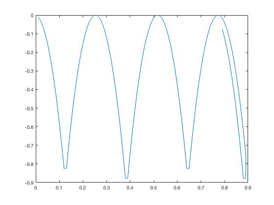

# Project Bouncing oriented Ball

This project aims to implement knowledge acquired in the classes of Técnicas de Programação 1 by means of the simulation of the fall of a ball inside a 2D box.

## Requirements

You must have a C ++ compiler installed on the machine.
The operating system can be Linux, Windows or MacOS.
Compiler installation:
- [Windows.](https://cs.calvin.edu/courses/cs/112/resources/installingEclipse/cygwin/)
- [Mac.](https://www.mkyong.com/mac/how-to-install-gcc-compiler-on-mac-os-x/)
- [Linux.](https://askubuntu.com/questions/348654/how-to-install-g-compiler)

## Installing/Compiling

Download the entire project directory, open the terminal or the equivalent of your machine, access the directory in which the project was downloaded using

```
cd /SeuDiretório/SuaPasta/tecnicadeprogramacao1
```
Then compile the test-ball.cpp, ball.cpp, and ball.h codes.

```
g++ test-ball.cpp ball.cpp ball.h simulation.h
```
Then run the a.out file

```
./a.out
```

## File description

- ball.h - abstract class containing the functions to be implemented in ball.cpp
- ball.cpp - class ball containing ball implementation
- simulation.h - interface for the ball
- test-ball.cpp - file to test the ball class
- ball.txt - test-ball.cpp file output
- plotBall.png - graph generated by MATLAB from ball.txt

### MATLAB results

MATLAB, used for visual data analysis, was the tool chosen to process the information (ball.txt) generated by the program (test-ball.cpp). From the output of test-ball.cpp it was possible to plot the following graph. It is possible to perceive that there is conservation of energy and, if there were a greater amount of repetitions, the graph would show several parables with the same maximum height.



### Class diagrams


### output

The output generated by the test-ball.cpp program and saved in the ball.txt file is as follows:

```
0.01 -0.00877778
0.02 -0.0284444
0.03 -0.059
0.04 -0.100444
0.05 -0.152778
0.06 -0.216
0.07 -0.290111
0.08 -0.375111
0.09 -0.471
0.1 -0.577778
0.11 -0.695444
0.12 -0.824
0.13 -0.824
0.14 -0.695444
0.15 -0.577778
0.16 -0.471
0.17 -0.375111
0.18 -0.290111
0.19 -0.216
0.2 -0.152778
0.21 -0.100444
0.22 -0.059
0.23 -0.0284444
0.24 -0.00877778
0.25 -8.1532e-17
0.26 -0.00211111
0.27 -0.0151111
0.28 -0.039
0.29 -0.0737778
0.3 -0.119444
0.31 -0.176
0.32 -0.243444
0.33 -0.321778
0.34 -0.411
0.35 -0.511111
0.36 -0.622111
0.37 -0.744
0.38 -0.876778
0.39 -0.876778
0.4 -0.744
0.41 -0.622111
0.42 -0.511111
0.43 -0.411
0.44 -0.321778
0.45 -0.243444
0.46 -0.176
0.47 -0.119444
0.48 -0.0737778
0.49 -0.039
0.5 -0.0151111
0.51 -0.00211111
0.52 -4.90059e-16
0.53 -0.00877778
0.54 -0.0284444
0.55 -0.059
0.56 -0.100444
0.57 -0.152778
0.58 -0.216
0.59 -0.290111
0.6 -0.375111
0.61 -0.471
0.62 -0.577778
0.63 -0.695444
0.64 -0.824
0.65 -0.824
0.66 -0.695444
0.67 -0.577778
0.68 -0.471
0.69 -0.375111
0.7 -0.290111
0.71 -0.216
0.72 -0.152778
0.73 -0.100444
0.74 -0.059
0.75 -0.0284444
0.76 -0.00877778
0.77 -7.47666e-16
0.78 -0.00211111
0.79 -0.0151111
0.8 -0.039
0.81 -0.0737778
0.82 -0.119444
0.83 -0.176
0.84 -0.243444
0.85 -0.321778
0.86 -0.411
0.87 -0.511111
0.88 -0.622111
0.89 -0.744
0.89 -0.876778
0.88 -0.876778
0.87 -0.744
0.86 -0.622111
0.85 -0.511111
0.84 -0.411
0.83 -0.321778
0.82 -0.243444
0.81 -0.176
0.8 -0.119444
0.79 -0.0737778
```

# Project Spring Mass

This project aims to implement knowledge acquired in Técnicas de Programação 1 by simulating the fall of two masses connected in a spring inside a 2D box.

## Requirements

The requirements are the same as those in part 1 of the project.
You must have a C ++ compiler installed on the machine.
The operating system can be Linux, Windows or MacOS.
Compiler installation:
- [Windows.](https://cs.calvin.edu/courses/cs/112/resources/installingEclipse/cygwin/)
- [Mac.](https://www.mkyong.com/mac/how-to-install-gcc-compiler-on-mac-os-x/)
- [Linux.](https://askubuntu.com/questions/348654/how-to-install-g-compiler)

## installation/Compilation

Download the entire project directory, open the terminal or the equivalent of your machine, access the directory in which the project was downloaded using

```
cd /SeuDiretório/SuaPasta/tecnicadeprogramacao1
```
Then compile the test-springmass.cpp, springmass.cpp and springmass.h codes.

```
g++ test-springmass.cpp springmass.cpp  springmass.h
```
Then run the a.out file

```
./a.out
```

## File description

- springmass.h - abstract class containing classes and functions to be implemented in springmass.cpp
- springmass.cpp - contains the spring, mass and springmass classes containing the implementations of the functions
- simulation.h - interface for springmass
- test-springmass.cpp - springmass test file
- springmass.txt - output from the test-springmass.cpp file.
- plotSpringmass.m - command to generate mass-spring object graph, special thanks to pro teacher for having given a tchans and shown how NOT to make a shitty chart in MATLAB, now almost looks like a GIF.
- plotSpringmass.png - graphic generated by MATLAB from springmass, consists of a static version of the image generated with the command plotSpringmass.m with 30 different moments. It is extremely advisable to use plotSpringmass.m and visualize the animation on MATLAB or Octave.

### MATLAB results

Using a line to represent the spring, blue circle for the first mass and red asterisk for the second mass, an image representing the first 30 states of the mass-spring object was generated, being the initial position of the first mass (-0.5; 0.5) and the second mass (0.5; 0).


### Class diagram


### Output

Partial view, the text file has a thousand lines due to a change in test-springmass.cpp.

```
-0.501114 0.518557 0.498886 0.0185572
-0.5 0.5 0.5 0
-0.496657 0.444328 0.503343 -0.0556716
-0.491085 0.351542 0.508915 -0.148458
-0.483284 0.221642 0.516716 -0.278358
-0.473255 0.0546274 0.526745 -0.445373
-0.460997 -0.149502 0.539003 -0.649502
-0.44651 -0.390745 0.55349 -0.890745
-0.429794 -0.669103 0.570206 -0.890745
-0.409541 -0.669103 0.590459 -0.575873
-0.389894 -0.317076 0.610106 -0.296874
-0.370174 -0.00104192 0.629826 -0.0538686
-0.350491 0.278993 0.649509 0.153138
-0.330838 0.523038 0.669162 0.324155
-0.311095 0.73109 0.688905 0.459178
-0.291037 0.90311 0.708963 0.558171
-0.270335 0.90311 0.729665 0.621036
-0.247965 0.803523 0.752035 0.647307
-0.224797 0.667702 0.775203 0.637345
-0.201433 0.495852 0.798567 0.591354
-0.17818 0.287994 0.82182 0.509355
-0.155003 0.044087 0.844997 0.391307
-0.131526 -0.235844 0.868474 0.237235
-0.107083 -0.551587 0.892917 0.0473502
-0.0807965 -0.902671 0.919203 -0.177875
-0.0516636 -0.902671 0.948336 -0.437672
-0.0159841 -0.482651 0.948336 -0.728705
0.0196348 -0.0984474 0.912284 -0.728705
0.0555208 0.249966 0.876499 -0.365346
0.0932142 0.561106 0.842522 -0.0392609
0.131533 0.835751 0.80917 0.250329
0.169354 0.835751 0.77532 0.504256
0.20783 0.629915 0.742125 0.722771
0.240129 0.394886 0.702752 0.912092
0.259725 0.123119 0.650678 0.912092
0.274994 -0.189175 0.594275 0.797944
0.288937 -0.540459 0.536548 0.644808
0.30318 -0.927793 0.47912 0.45562
0.318552 -0.927793 0.422821 0.233972
0.335787 -0.476182 0.368385 -0.00885352
0.353421 -0.0543573 0.314348 -0.281465
0.368415 0.301998 0.257671 -0.619546
0.386547 0.641064 0.204133 -0.974917
0.405121 0.948337 0.151035 -0.974917
0.421909 0.948337 0.0961521 -0.53362
0.435803 0.743226 0.0383756 -0.152564
0.446606 0.489819 -0.0224927 0.180196
0.455131 0.202593 -0.085639 0.479138
0.474717 -0.11016 -0.137724 0.752553
0.503785 -0.464979 -0.180327 0.752553
0.531158 -0.854291 -0.224625 0.551066
0.554698 -0.854291 -0.272755 0.320137
0.569999 -0.407987 -0.329125 0.0692505
```

# Project Graphics

This project aims to implement knowledge acquired in the classes of Técnicas de Programação 1 through the graphic simulation of the fall of a mass and two masses connected in a spring inside a 2D box. This is the final part of the project and encompasses all previously developed codes.

# Português

# Projeto Bouncing oriented Ball

Este projeto tem por finalidade implementar conhecimentos adquiridos nas aulas de Técnicas de Programação 1 por meio da simulação da queda de uma bola dentro de uma caixa 2D.

## Requisitos

É necessário ter instalado na máquina um compilador de C++.
O sistema operacional pode ser o Linux, Windows ou MacOS.
Instalação do compilador:
- [Windows.](https://cs.calvin.edu/courses/cs/112/resources/installingEclipse/cygwin/)
- [Mac.](https://www.mkyong.com/mac/how-to-install-gcc-compiler-on-mac-os-x/)
- [Linux.](https://askubuntu.com/questions/348654/how-to-install-g-compiler)

## Instalação/Compilação

Baixe todo o diretório do projeto, abra o terminal ou equivalente da sua máquina, acesse o diretório no qual o projeto foi baixado usando

```
cd /SeuDiretório/SuaPasta/tecnicadeprogramacao1
```
Depois deve-se compilar os códigos test-ball.cpp, ball.cpp e ball.h

```
g++ test-ball.cpp ball.cpp ball.h simulation.h
```
E aí executar o arquivo a.out

```
./a.out
```

## Descrição dos arquivos

- ball.h - classe abstrata contendo as funções a serem implementadas em ball.cpp
- ball.cpp - classe ball contendo a implementação de ball
- simulation.h - interface para a ball
- test-ball.cpp - arquivo para teste da classe ball
- ball.txt - saída do arquivo test-ball.cpp
- plotBall.png - gráfico gerado pelo MATLAB a partir do ball.txt

### Resultado MATLAB

O MATLAB, usado para análise visual de dados, foi a ferramenta escolhida para processar a informação (ball.txt) gerada pelo programa (test-ball.cpp). A partir da saída do test-ball.cpp foi possível plottar o seguinte gráfico. É possível perceber que há conservação de energia e, caso houvesse uma quantidade maior de repitições, o gráfico mostraria diversas parábolas com a mesma altura máxima.


### Diagrama de Classes


### Saída

A saída gerada pelo programa test-ball.cpp e salva no arquivo ball.txt é a seguinte:

```
0.01 -0.00877778
0.02 -0.0284444
0.03 -0.059
0.04 -0.100444
0.05 -0.152778
0.06 -0.216
0.07 -0.290111
0.08 -0.375111
0.09 -0.471
0.1 -0.577778
0.11 -0.695444
0.12 -0.824
0.13 -0.824
0.14 -0.695444
0.15 -0.577778
0.16 -0.471
0.17 -0.375111
0.18 -0.290111
0.19 -0.216
0.2 -0.152778
0.21 -0.100444
0.22 -0.059
0.23 -0.0284444
0.24 -0.00877778
0.25 -8.1532e-17
0.26 -0.00211111
0.27 -0.0151111
0.28 -0.039
0.29 -0.0737778
0.3 -0.119444
0.31 -0.176
0.32 -0.243444
0.33 -0.321778
0.34 -0.411
0.35 -0.511111
0.36 -0.622111
0.37 -0.744
0.38 -0.876778
0.39 -0.876778
0.4 -0.744
0.41 -0.622111
0.42 -0.511111
0.43 -0.411
0.44 -0.321778
0.45 -0.243444
0.46 -0.176
0.47 -0.119444
0.48 -0.0737778
0.49 -0.039
0.5 -0.0151111
0.51 -0.00211111
0.52 -4.90059e-16
0.53 -0.00877778
0.54 -0.0284444
0.55 -0.059
0.56 -0.100444
0.57 -0.152778
0.58 -0.216
0.59 -0.290111
0.6 -0.375111
0.61 -0.471
0.62 -0.577778
0.63 -0.695444
0.64 -0.824
0.65 -0.824
0.66 -0.695444
0.67 -0.577778
0.68 -0.471
0.69 -0.375111
0.7 -0.290111
0.71 -0.216
0.72 -0.152778
0.73 -0.100444
0.74 -0.059
0.75 -0.0284444
0.76 -0.00877778
0.77 -7.47666e-16
0.78 -0.00211111
0.79 -0.0151111
0.8 -0.039
0.81 -0.0737778
0.82 -0.119444
0.83 -0.176
0.84 -0.243444
0.85 -0.321778
0.86 -0.411
0.87 -0.511111
0.88 -0.622111
0.89 -0.744
0.89 -0.876778
0.88 -0.876778
0.87 -0.744
0.86 -0.622111
0.85 -0.511111
0.84 -0.411
0.83 -0.321778
0.82 -0.243444
0.81 -0.176
0.8 -0.119444
0.79 -0.0737778
```

# Projeto Spring Mass

Este projeto tem por finalidade implementar conhecimentos adquiridos nas aulas de Técnicas de Programação 1 por meio da simulação da queda de duas massas conectadas em uma mola dentro de uma caixa 2D.

## Requisitos

Os requisitos são os mesmos da parte 1 do projeto.
É necessário ter instalado na máquina um compilador de C++.
O sistema operacional pode ser o Linux, Windows ou MacOS.
Instalação do compilador:
- [Windows.](https://cs.calvin.edu/courses/cs/112/resources/installingEclipse/cygwin/)
- [Mac.](https://www.mkyong.com/mac/how-to-install-gcc-compiler-on-mac-os-x/)
- [Linux.](https://askubuntu.com/questions/348654/how-to-install-g-compiler)

## Instalação/Compilação

Baixe todo o diretório do projeto, abra o terminal ou equivalente da sua máquina, acesse o diretório no qual o projeto foi baixado usando

```
cd /SeuDiretório/SuaPasta/tecnicadeprogramacao1
```
Depois deve-se compilar os códigos test-springmass.cpp, springmass.cpp e springmass.h

```
g++ test-springmass.cpp, springmass.cpp e springmass.h
```
E aí executar o arquivo a.out

```
./a.out
```

## Descrição dos arquivos

- springmass.h - classe abstrata contendo as classes e funções a serem implementadas em springmass.cpp
- springmass.cpp - contém as classes spring, mass e springmass contendo as implementações das funções
- simulation.h - interface para a springmass
- test-springmass.cpp - arquivo para teste da classe springmass
- ball.txt - saída do arquivo test-springmass.cpp, deveria ser springmass.txt, mas preferi ball.
- plotSpringmass.m - comando para gerar o gráfico do objeto massa-mola, special thanks pro professor por ter dado um tchans e mostrado como não se fazer um gráfico cagado no MATLAB, agora quase parece um GIF.
- plotSpringmass.png - gráfico gerado pelo MATLAB a partir do springmass, consiste em uma versão estática da imagem gerada com o comando plotSpringmass.m com 30 momentos difeerentes. Extremamente aconselhável usar o plotSpringmass.m e visualizar a animação pelo MATLAB ou Octave.

### Resultado MATLAB

Usando linha para representar a mola, círculo azul para a primeira massa e asterisco vermelho para a segunda massa, foi gerada uma imagem representando os 30 primeiros estados do objeto massa-mola, sendo a posição inicial da primeira massa (-0.5;0.5) e a segunda massa (0.5;0).


### Diagrama de Classes


### Saída

Visualização parcial, o arquivo texto possui mil linhas devido a uma alteração em test-springmass.cpp.

```
-0.501114 0.518557 0.498886 0.0185572
-0.5 0.5 0.5 0
-0.496657 0.444328 0.503343 -0.0556716
-0.491085 0.351542 0.508915 -0.148458
-0.483284 0.221642 0.516716 -0.278358
-0.473255 0.0546274 0.526745 -0.445373
-0.460997 -0.149502 0.539003 -0.649502
-0.44651 -0.390745 0.55349 -0.890745
-0.429794 -0.669103 0.570206 -0.890745
-0.409541 -0.669103 0.590459 -0.575873
-0.389894 -0.317076 0.610106 -0.296874
-0.370174 -0.00104192 0.629826 -0.0538686
-0.350491 0.278993 0.649509 0.153138
-0.330838 0.523038 0.669162 0.324155
-0.311095 0.73109 0.688905 0.459178
-0.291037 0.90311 0.708963 0.558171
-0.270335 0.90311 0.729665 0.621036
-0.247965 0.803523 0.752035 0.647307
-0.224797 0.667702 0.775203 0.637345
-0.201433 0.495852 0.798567 0.591354
-0.17818 0.287994 0.82182 0.509355
-0.155003 0.044087 0.844997 0.391307
-0.131526 -0.235844 0.868474 0.237235
-0.107083 -0.551587 0.892917 0.0473502
-0.0807965 -0.902671 0.919203 -0.177875
-0.0516636 -0.902671 0.948336 -0.437672
-0.0159841 -0.482651 0.948336 -0.728705
0.0196348 -0.0984474 0.912284 -0.728705
0.0555208 0.249966 0.876499 -0.365346
0.0932142 0.561106 0.842522 -0.0392609
0.131533 0.835751 0.80917 0.250329
0.169354 0.835751 0.77532 0.504256
0.20783 0.629915 0.742125 0.722771
0.240129 0.394886 0.702752 0.912092
0.259725 0.123119 0.650678 0.912092
0.274994 -0.189175 0.594275 0.797944
0.288937 -0.540459 0.536548 0.644808
0.30318 -0.927793 0.47912 0.45562
0.318552 -0.927793 0.422821 0.233972
0.335787 -0.476182 0.368385 -0.00885352
0.353421 -0.0543573 0.314348 -0.281465
0.368415 0.301998 0.257671 -0.619546
0.386547 0.641064 0.204133 -0.974917
0.405121 0.948337 0.151035 -0.974917
0.421909 0.948337 0.0961521 -0.53362
0.435803 0.743226 0.0383756 -0.152564
0.446606 0.489819 -0.0224927 0.180196
0.455131 0.202593 -0.085639 0.479138
0.474717 -0.11016 -0.137724 0.752553
0.503785 -0.464979 -0.180327 0.752553
0.531158 -0.854291 -0.224625 0.551066
0.554698 -0.854291 -0.272755 0.320137
0.569999 -0.407987 -0.329125 0.0692505
```

# Projeto Graphics

Este projeto tem por finalidade implementar conhecimentos adquiridos nas aulas de Técnicas de Programação 1 por meio da simulação gráfica da queda de uma massa e de duas massas conectadas em uma mola dentro de uma caixa 2D. Esta é a parte final do projeto e engloba todos os códigos anteriormente desenvolvidos.
