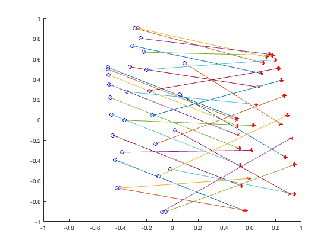
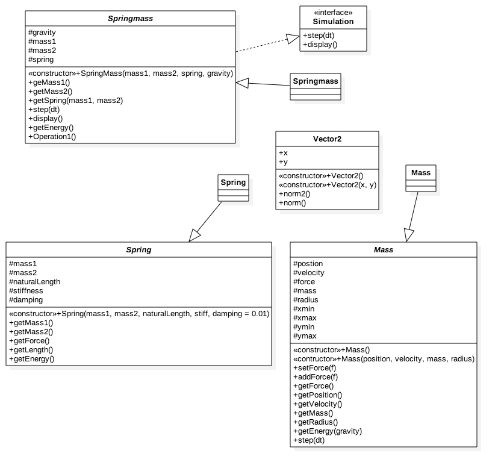

# Projeto Spring Mass

Este projeto tem por finalidade implementar conhecimentos adquiridos nas aulas de Técnicas de Programação 1 por meio da simulação da queda de duas massas conectadas em uma mola dentro de uma caixa 2D.

## Requisitos

Os requisitos são os mesmos da parte 1 do projeto.
É necessário ter instalado na máquina um compilador de C++.
O sistema operacional pode ser o Linux, Windows ou MacOS.
Instalação do compilador:
- [Windows.](https://cs.calvin.edu/courses/cs/112/resources/installingEclipse/cygwin/)
- [Mac.](https://www.mkyong.com/mac/how-to-install-gcc-compiler-on-mac-os-x/)
- [Linux.](https://askubuntu.com/questions/348654/how-to-install-g-compiler)

## Instalação/Compilação

Baixe todo o diretório do projeto, abra o terminal ou equivalente da sua máquina, acesse o diretório no qual o projeto foi baixado usando

```
cd /SeuDiretório/SuaPasta/tecnicadeprogramacao1/parte2
```
Depois deve-se compilar os códigos test-springmass.cpp, springmass.cpp e springmass.h

```
g++ test-springmass.cpp, springmass.cpp e springmass.h
```
E aí executar o arquivo a.out

```
./a.out
```

## Descrição dos arquivos

- springmass.h - classe abstrata contendo as classes e funções a serem implementadas em springmass.cpp
- springmass.cpp - contém as classes spring, mass e springmass contendo as implementações das funções
- simulation.h - interface para a springmass
- test-springmass.cpp - arquivo para teste da classe springmass
- ball.txt - saída do arquivo test-springmass.cpp, deveria ser springmass.txt, mas preferi ball.
- plotSpringmass.m - comando para gerar o gráfico do objeto massa-mola, special thanks pro professor por ter dado um tchans e mostrado como não se fazer um gráfico cagado no MATLAB, agora quase parece um GIF.
- plotSpringmass.png - gráfico gerado pelo MATLAB a partir do springmass, consiste em uma versão estática da imagem gerada com o comando plotSpringmass.m com 30 momentos difeerentes. Extremamente aconselhável usar o plotSpringmass.m e visualizar a animação pelo MATLAB ou Octave.

### Resultado MATLAB

O MATLAB é usado para análise visual de dados. A partir da saída do test-springmass.cpp foi possível plottar o seguinte gráfico.



### Diagrama de Classes



### Saída

Visualização parcial, o arquivo texto possui mil linhas devido a uma alteração em test-springmass.cpp.

```
-0.501114 0.518557 0.498886 0.0185572
-0.5 0.5 0.5 0
-0.496657 0.444328 0.503343 -0.0556716
-0.491085 0.351542 0.508915 -0.148458
-0.483284 0.221642 0.516716 -0.278358
-0.473255 0.0546274 0.526745 -0.445373
-0.460997 -0.149502 0.539003 -0.649502
-0.44651 -0.390745 0.55349 -0.890745
-0.429794 -0.669103 0.570206 -0.890745
-0.409541 -0.669103 0.590459 -0.575873
-0.389894 -0.317076 0.610106 -0.296874
-0.370174 -0.00104192 0.629826 -0.0538686
-0.350491 0.278993 0.649509 0.153138
-0.330838 0.523038 0.669162 0.324155
-0.311095 0.73109 0.688905 0.459178
-0.291037 0.90311 0.708963 0.558171
-0.270335 0.90311 0.729665 0.621036
-0.247965 0.803523 0.752035 0.647307
-0.224797 0.667702 0.775203 0.637345
-0.201433 0.495852 0.798567 0.591354
-0.17818 0.287994 0.82182 0.509355
-0.155003 0.044087 0.844997 0.391307
-0.131526 -0.235844 0.868474 0.237235
-0.107083 -0.551587 0.892917 0.0473502
-0.0807965 -0.902671 0.919203 -0.177875
-0.0516636 -0.902671 0.948336 -0.437672
-0.0159841 -0.482651 0.948336 -0.728705
0.0196348 -0.0984474 0.912284 -0.728705
0.0555208 0.249966 0.876499 -0.365346
0.0932142 0.561106 0.842522 -0.0392609
0.131533 0.835751 0.80917 0.250329
0.169354 0.835751 0.77532 0.504256
0.20783 0.629915 0.742125 0.722771
0.240129 0.394886 0.702752 0.912092
0.259725 0.123119 0.650678 0.912092
0.274994 -0.189175 0.594275 0.797944
0.288937 -0.540459 0.536548 0.644808
0.30318 -0.927793 0.47912 0.45562
0.318552 -0.927793 0.422821 0.233972
0.335787 -0.476182 0.368385 -0.00885352
0.353421 -0.0543573 0.314348 -0.281465
0.368415 0.301998 0.257671 -0.619546
0.386547 0.641064 0.204133 -0.974917
0.405121 0.948337 0.151035 -0.974917
0.421909 0.948337 0.0961521 -0.53362
0.435803 0.743226 0.0383756 -0.152564
0.446606 0.489819 -0.0224927 0.180196
0.455131 0.202593 -0.085639 0.479138
0.474717 -0.11016 -0.137724 0.752553
0.503785 -0.464979 -0.180327 0.752553
0.531158 -0.854291 -0.224625 0.551066
0.554698 -0.854291 -0.272755 0.320137
0.569999 -0.407987 -0.329125 0.0692505
```


